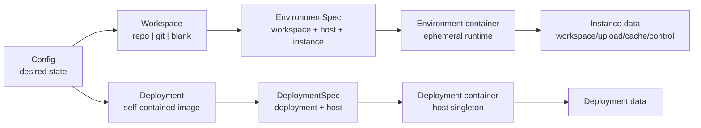
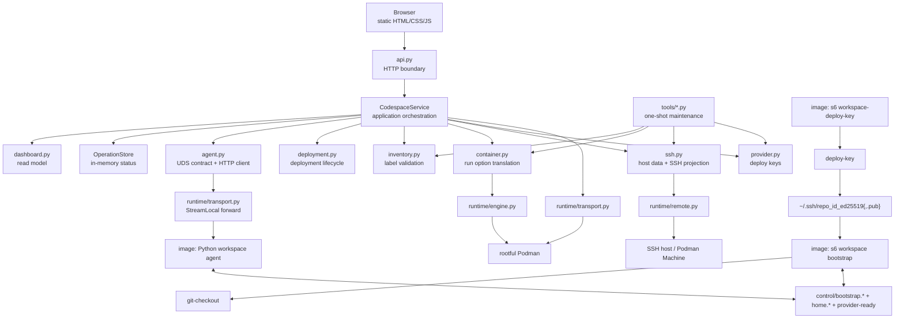
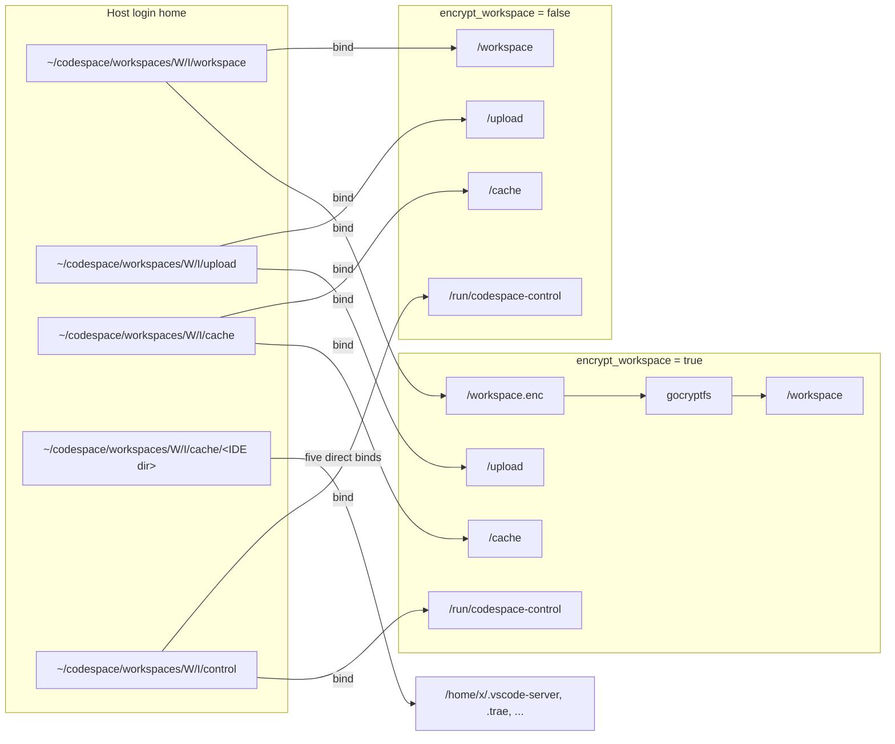
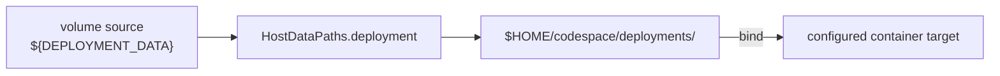
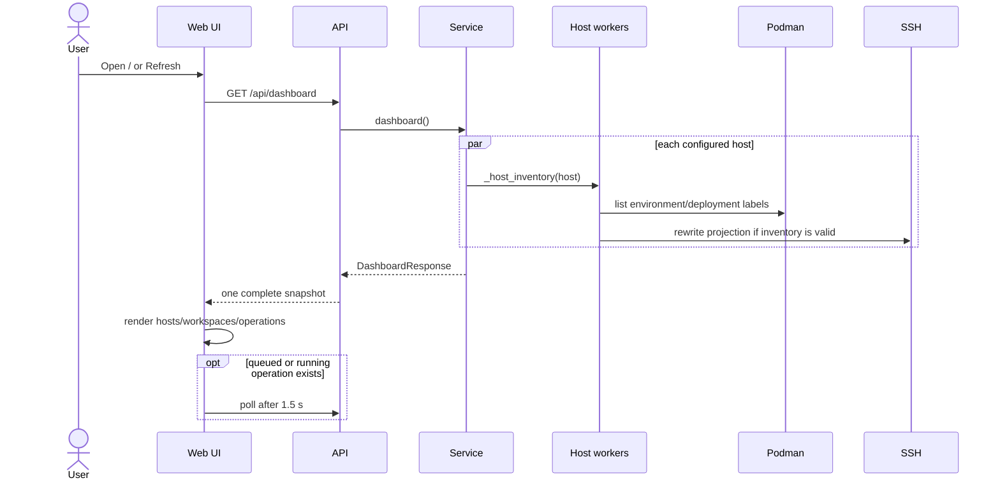
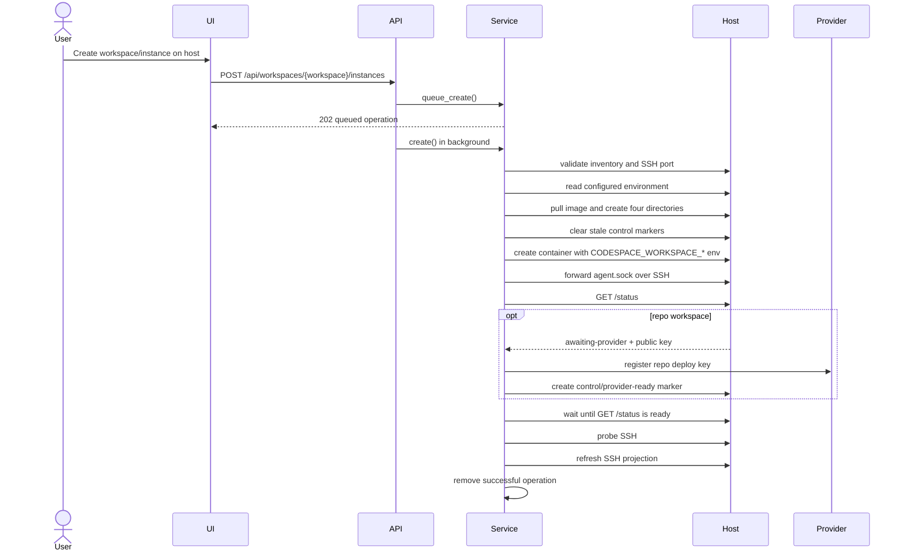
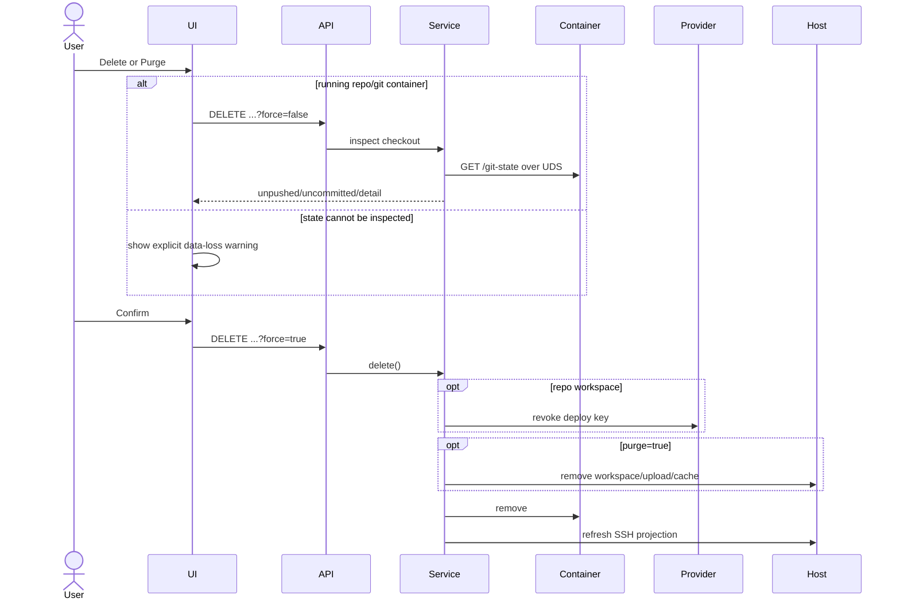
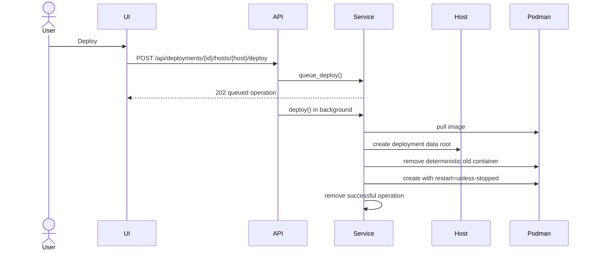
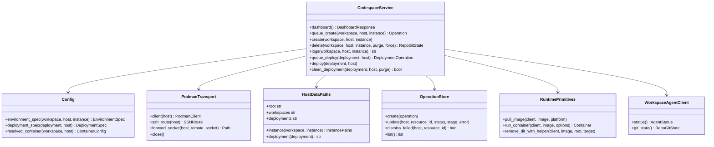

# Codespace 控制面设计

## 目标与边界

Codespace 把静态配置中的 workspace 蓝图实例化为 host 上的开发容器，并维护本机 SSH 入口。它还可管理
host 级自包含镜像（deployment），例如 sidecar 和 LLM serving。

控制面负责：

- 加载并校验配置，生成不可变的 `EnvironmentSpec` / `DeploymentSpec`；
- 通过 SSH tunnel 或 Podman Machine socket 调用 rootful Podman；
- 创建、查看和删除 environment，维护 provider deploy key 与本机 SSH 投影；
- reconcile、查看和清理 deployment；
- 提供 localhost-only Web UI，以及不依赖 Web 进程的维护 CLI。

控制面不负责镜像构建、registry 发布、host 初始化、数据备份、secret 托管或容器内服务编排。开发镜像内
由 s6 监督的 Bash helper负责 workspace bootstrap，Python agent只聚合状态与执行 Git查询；控制面经逐实例
Unix Domain Socket调用 agent，不开放 TCP端口。镜像是运行契约，Podman label是 inventory契约，host
文件系统是持久数据与本机 IPC契约。

## Domain Model



核心对象：

| 对象 | 身份 | 生命周期 | 持久状态 |
| --- | --- | --- | --- |
| Workspace | 配置 key | 随配置存在 | 无 |
| Environment | `host + workspace + instance` | 用户高频创建/删除 | 一个 instance 目录、三个数据子目录及 control IPC 目录 |
| Deployment | 配置 key | 随配置存在 | 无 |
| Deployment container | `host + deployment` | 运维 reconcile/clean | 一个 deployment data 目录 |
| Operation | `host + resource id` | 单进程内短期状态 | 无，重启即丢弃 |

Environment 与 deployment 使用不相交的 label：

- Environment：`codespace.managed=true` 加 workspace、instance、type、image、platform、SSH port。
- Deployment：`codespace.deployment=true` 加 deployment id、image，不得带 `codespace.managed`。

Podman inventory 是实际运行状态的唯一来源。配置只表达期望形态；Dashboard 不缓存 container 状态。

## Component Model



分层规则：

1. `runtime/` 只提供 transport、Podman、remote command 和 Compose syntax 原语。
2. `container.py`、`inventory.py`、`ssh.py` 把 Codespace 契约映射到底层原语。
3. `service.py` 只编排步骤、回滚和 operation 状态，不解析 YAML、不拼 Podman 参数。
4. `api.py` 只做 HTTP 输入/输出与错误映射；浏览器不直接推导资源状态。
5. 一次性维护命令直接复用业务原语，不经过 HTTP，也不复制生命周期实现。

## Host 数据布局

所有路径先由 host 登录 shell 展开 `$HOME`，再以绝对路径传给 Podman。SSH host 与 Podman Machine 使用相同
逻辑布局。

```text
$HOME/codespace/
├── workspaces/
│   └── <workspace>/<instance>/
│       ├── workspace/                # workspace 明文或 gocryptfs 密文
│       ├── upload/                   # upload 明文
│       ├── cache/                    # tool/IDE cache 明文
│       └── control/                  # bootstrap/home marker、provider-ready、agent.sock，0700
└── deployments/
    └── <deployment>/                 # deployment 托管数据
```

### Environment mounts



- `workspace-init` 把 workspace 数据 mount 归属到 `5230:5230`，并在同一 oneshot 内降权完成加密挂载；
  `control` 保持 host login user 的
  `0700` 权限。容器内 agent以 root绑定 socket，bootstrap helper和 Git查询子进程降权到用户 `x`。
- 加密模式只改变 workspace 的 container target；host 上同一目录存放密文。
- `/upload` 与 `/cache` 始终明文，并与 workspace/instance 同粒度隔离。
- `cache/` 下五个 IDE 子目录直接 bind 到各自 `/home/x/` canonical path；`/cache` 主挂载继续供构建和工具缓存使用。
- 控制面在创建 container前清空旧 control marker；bootstrap用 `bootstrap.ready` / `bootstrap.failed`
  记录结果，异步 home初始化用 `home.ready` / `home.failed` 记录结果，agent启动时清理并重建
  `agent.sock`。
- `/provider-ready` 在 `control/provider-ready` 原子持久化；同一 container重启后可继续幂等 bootstrap，
  新 create会先清空旧 marker。
- `purge=false` 只删除 container；`purge=true` 删除包含四个子目录的 instance 目录。
- 用户 volume 不得覆盖任何保留 mount path 或其父子路径。

### Deployment mounts



Deployment 没有 `/workspace`、`/upload`、`/cache`、SSH port 或 repository credential。
`${DEPLOYMENT_DATA}` 是唯一受控占位符；其它 volume source 必须是显式绝对路径。`clean` 保留 data root，
`purge` 删除它。

本机另有 SSH 投影：

```text
~/.ssh/config                         # 仅包含 Include
~/.ssh/codespace/config               # 公共 Host codespace-* 规则
~/.ssh/codespace/login_key            # 固定登录私钥，0600
~/.ssh/codespace/known_hosts/*         # pinned container/machine host keys
~/.ssh/codespace/hosts/<host>.conf     # 按 host 原子重写的 environment 列表
```

## Web UI 执行流程

### Dashboard refresh



Host 查询并发且相互隔离。单个 host 离线只影响该 host 的状态；inventory label 错误必须显示，不得把损坏
container 当成正常资源。

### Create environment



失败回滚以 provider 状态为边界：deploy key 注册前可直接删 container；注册后必须先撤销 key。撤销失败时停止并
保留带 label 的 container，避免遗失可恢复状态。Host 数据目录不在创建失败时清理。

### Delete environment



预检只读且不启动已停止的 container。Provider 撤销失败时不得删除 container 或 host 数据。

### Deployment reconcile



重复 deploy 是 reconcile：结果收敛到当前配置，不保留旧 container 形态。Clean 仅删 container，Purge 再删
deployment data。Sidecar 的 Atuin 监听端口由 deployment container 环境变量 `ATUIN_PORT` 配置（默认
`8002`）；使用 bridge network 时，`published_ports` 的容器端口必须同步匹配。

## Key Interfaces

现有关键接口及依赖方向如下。这里只抽象跨模块协作点，不为每个函数创建 interface。



接口设计原则：

- `Config` 在边界完成校验和分层解析；下游只接收 resolved spec。
- `CodespaceService` 拥有进程内 mutable state，但不拥有 host 或 container 持久状态。
- `PodmanTransport` 是 Podman 连接与所有 SSH tunnel 生命周期的唯一 owner。
- `runtime` 函数接收已解析参数，不知道 workspace、deployment 或 label 语义。
- s6 oneshot无条件生成 deploy key；s6-supervised bootstrap拥有固定启动状态机并调用 Git checkout、
  open path helper；agent只提供协议、持久握手和动态 Git state查询，控制面不得复制或通过 Podman exec
  触发这些步骤。
- 只在外部 I/O 需要替换实现时引入 `Protocol`；模块内函数不为测试而包装成 class。

## Workspace Agent Protocol

控制面创建 container时注入以下保留环境变量，用户 container environment与 env secret不得覆盖：

| Environment | Value |
| --- | --- |
| `CODESPACE_WORKSPACE_TYPE` | `repo`、`git` 或 `blank`；注入即激活 Controller 专用服务 |
| `CODESPACE_CLONE_URL` | repo/git 的 SSH clone URL；blank不注入 |
| `CODESPACE_CLONE_PATH` | checkout target |
| `CODESPACE_OPEN_PATH` | editor open path |

agent只监听 `/run/codespace-control/agent.sock`，HTTP API固定为：

| Method | Path | Result |
| --- | --- | --- |
| `GET` | `/status` | `{state,public_key,error}` |
| `GET` | `/git-state` | `CODESPACE_CLONE_PATH` 对应 `RepoGitState` |

状态只允许 `starting`、`awaiting-provider`、`ready`、`failed`。单一 runlevel `user-final` 含全部服务；
`workspace-deploy-key`、`workspace-bootstrap`、`workspace-agent` 按 `CODESPACE_WORKSPACE_TYPE` 是否注入
自门控（通用镜像未注入时空转），三者在 `workspace-init` 后启动，
`workspace-bootstrap` 与 `workspace-agent` 均依赖 `workspace-deploy-key`：

- `workspace-deploy-key` 在 `CODESPACE_WORKSPACE_TYPE` 已注入时对所有 workspace无条件生成或复用
  container-local keypair，private key不离开容器；未注入时跳过。
- `workspace-bootstrap` 是受监督 longrun，直接执行 Bash helper并按容器环境选择流程；成功写
  `bootstrap.ready`，失败写 `bootstrap.failed`，随后保持运行，不占用 s6-rc oneshot事务。
- 五个 IDE home目录在 container创建时已经直接挂载；异步 `home-init` 完成或失败后分别写 `home.ready`、
  `home.failed`。`/status` 只有在 bootstrap与home marker都 ready时才返回 `ready`。
- `repo`：agent从 `/home/x/.ssh/repo_id_ed25519.pub` 返回公钥并进入 `awaiting-provider`；控制面注册
  deploy key后在 host control目录创建 `provider-ready` marker，bootstrap随后执行 checkout和 open-path helper。
- `git`：bootstrap直接调用 checkout 和 open-path helper；`blank`：bootstrap只调用 open-path helper。
- checkout/open-path以用户 `x` 执行；失败 marker使 `/status` 进入 `failed` 并返回有限长度诊断。
- Python只保留一个单文件 `workspace_agent.py` 进程；Pydantic校验环境与响应模型，FastAPI声明固定 route、
  Uvicorn监听 UDS，依赖由 `/opt/codespace/uv.lock` 固定。
- `/git-state` 仅在 `ready` 的 repo/git workspace 可用，由 agent以用户 `x` 直接执行只读 Git查询。
- agent 不提供任意 command、path、environment 或 shell 参数；未知 route/method 直接拒绝。
- provider token、deploy key 注册、Podman 生命周期、host 数据和 SSH 投影不进入镜像协议；deploy private key
  不离开容器。
- agent readiness 后控制面仍执行端到端 SSH probe。
- UDS 通过 OpenSSH `StreamLocal` 转发到 controller 的私有 runtime 目录，不发布 host/container TCP port。
- 协议直接使用最终 schema，不提供 exec fallback、旧参数、版本协商或 migration。

## 一次性运维边界

同步 secret、清理 orphan workspace、清理 orphan deploy key 都是人工触发的收敛操作，不属于用户每次打开
Dashboard 的主流程。它们必须具备：

1. 单用途 Python 入口；
2. 默认 dry-run；
3. 先完整生成计划，再执行写操作；
4. host 级失败隔离和最终错误汇总；
5. 直接复用 `Config`、`PodmanTransport`、inventory/provider/container 原语；
6. 不增加 Web API、浏览器状态、operation model 或常驻 scheduler。

当前入口：

| 命令 | 单一职责 |
| --- | --- |
| `controller.tools.sync_secrets` | 把配置中的 secret 收敛到各 Podman host |
| `controller.tools.cleanup_workspaces` | 删除无受管 environment 引用的 instance 数据目录 |
| `controller.tools.cleanup_deploy_keys` | 删除无受管 environment 引用的 provider deploy key |

通用 deployment 覆盖所有自包含镜像，不提供 sidecar 专用部署 CLI。镜像目录的 `run-*.sh` 仅用于本地
smoke test，不得形成独立配置或生产生命周期。

进一步缩小 Web/API 的候选方案是把 deployment reconcile/clean/logs 全部移到一个高内聚的
`controller.tools.deployments` CLI。是否执行取决于 deployment 是高频交互还是低频运维；一旦选择 CLI，
必须同时删除对应 UI、HTTP route、Dashboard model 和 deployment operation store，不能保留双轨入口。

## 不变量

- 所有写操作基于确定性 identity，并先验证 inventory。
- Environment 与 deployment 的 container、label、数据根和生命周期不复用。
- `/workspace`、`/workspace.enc`、`/upload`、`/cache`、`/run/codespace-control` 以及五个
  `/home/x/` IDE mount target 是控制面保留路径。
- SSH host key verification、provider TLS verification 和 localhost 网络边界不可放宽。
- 配置、container label、镜像 helper 和 API model 的同一字段必须同步变更。
- 不增加兼容字段、迁移分支、旧 label 读取或旧目录探测；需要切换契约时直接修改最终形态。
