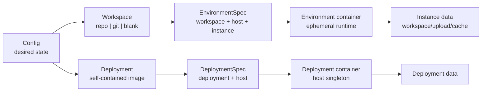
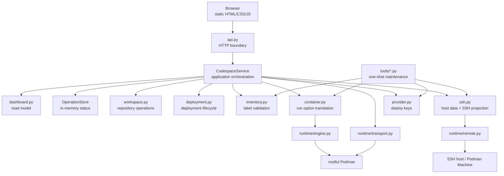
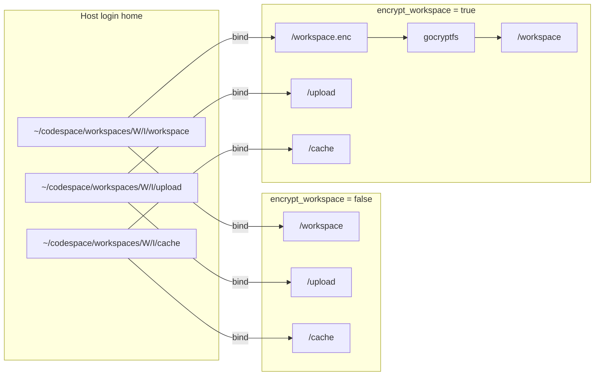
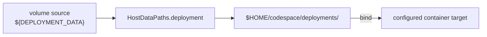
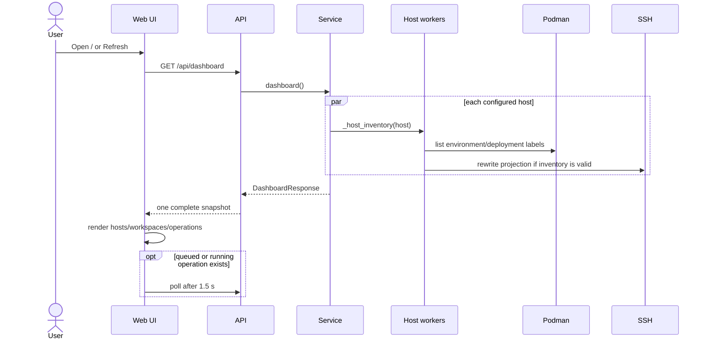
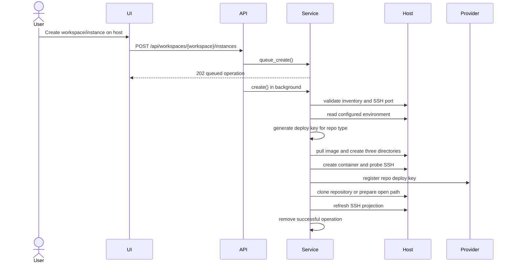
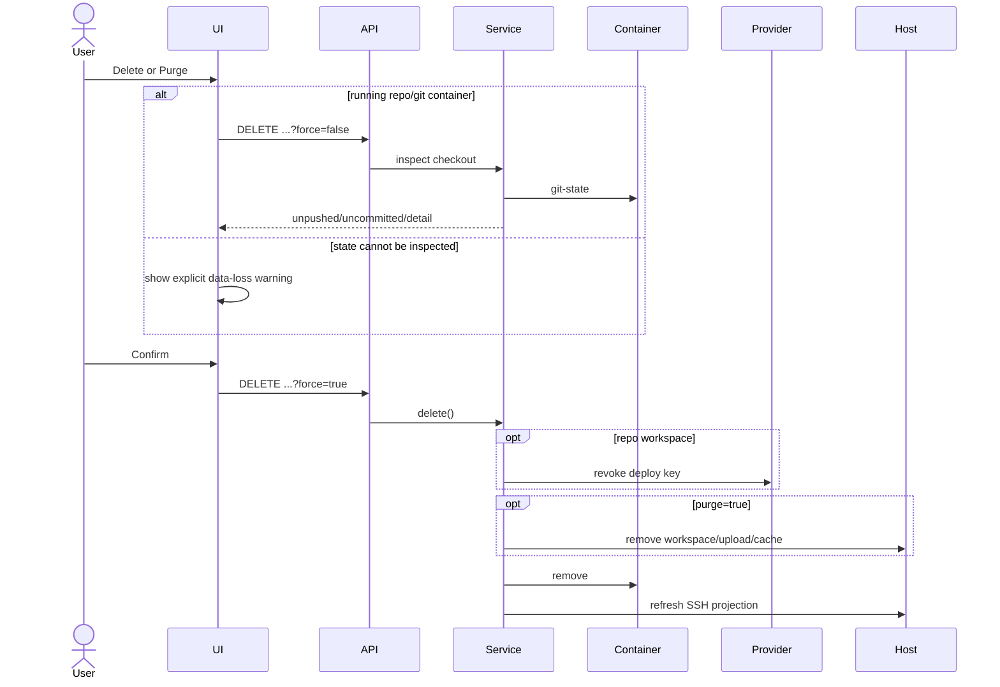
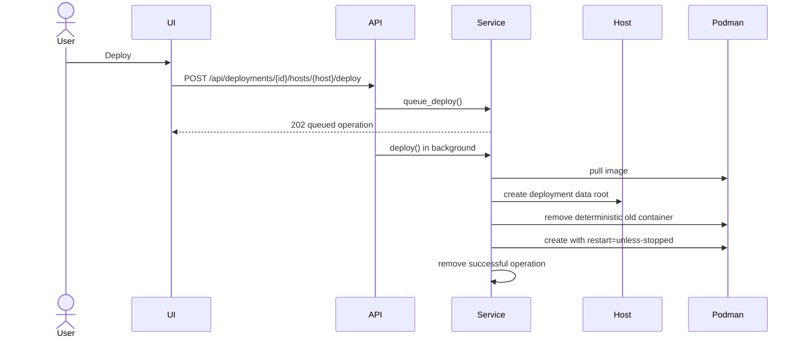
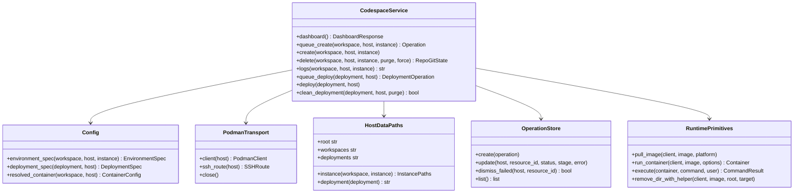

# Codespace 控制面设计

## 目标与边界

Codespace 把静态配置中的 workspace 蓝图实例化为 host 上的开发容器，并维护本机 SSH 入口。它还可管理
host 级自包含镜像（deployment），例如 sidecar 和 LLM serving。

控制面负责：

- 加载并校验配置，生成不可变的 `EnvironmentSpec` / `DeploymentSpec`；
- 通过 SSH tunnel 或 Podman Machine socket 调用 rootful Podman；
- 创建、查看和删除 environment，维护 provider deploy key 与本机 SSH 投影；
- reconcile、查看和清理 deployment；
- 提供 localhost-only Web UI，以及不依赖 Web 进程的维护 CLI。

控制面不负责镜像构建、registry 发布、host 初始化、数据备份、secret 托管、容器内服务编排或远端
HTTP agent。镜像是运行契约，Podman label 是 inventory 契约，host 文件系统是持久数据契约。

## Domain Model



核心对象：

| 对象 | 身份 | 生命周期 | 持久状态 |
| --- | --- | --- | --- |
| Workspace | 配置 key | 随配置存在 | 无 |
| Environment | `host + workspace + instance` | 用户高频创建/删除 | 一个 instance 目录及三个数据子目录 |
| Deployment | 配置 key | 随配置存在 | 无 |
| Deployment container | `host + deployment` | 运维 reconcile/clean | 一个 deployment data 目录 |
| Operation | `host + resource id` | 单进程内短期状态 | 无，重启即丢弃 |

Environment 与 deployment 使用不相交的 label：

- Environment：`codespace.managed=true` 加 workspace、instance、type、image、platform、SSH port。
- Deployment：`codespace.deployment=true` 加 deployment id、image，不得带 `codespace.managed`。

Podman inventory 是实际运行状态的唯一来源。配置只表达期望形态；Dashboard 不缓存 container 状态。

## Component Model



分层规则：

1. `runtime/` 只提供 transport、Podman、remote command 和 Compose syntax 原语。
2. `container.py`、`inventory.py`、`ssh.py` 把 Codespace 契约映射到底层原语。
3. `service.py` 只编排步骤、回滚和 operation 状态，不解析 YAML、不拼 Podman 参数。
4. `api.py` 只做 HTTP 输入/输出与错误映射；浏览器不直接推导资源状态。
5. 一次性维护命令直接复用业务原语，不经过 HTTP，也不复制生命周期实现。

## Host 数据布局

所有路径先由 host 登录 shell 展开 `$HOME`，再以绝对路径传给 Podman。SSH host 与 Podman Machine 使用相同
逻辑布局。

```text
$HOME/codespace/
├── workspaces/
│   └── <workspace>/<instance>/
│       ├── workspace/                # workspace 明文或 gocryptfs 密文
│       ├── upload/                   # upload 明文
│       └── cache/                    # tool/IDE cache 明文
└── deployments/
    └── <deployment>/                 # deployment 托管数据
```

### Environment mounts



- `workspace-init` 先把四个保留 mount path 归属到 `5230:5230`。
- 加密模式只改变 workspace 的 container target；host 上同一目录存放密文。
- `/upload` 与 `/cache` 始终明文，并与 workspace/instance 同粒度隔离。
- `purge=false` 只删除 container；`purge=true` 删除包含三个数据子目录的 instance 目录。
- 用户 volume 不得覆盖任何保留 mount path 或其父子路径。

### Deployment mounts



Deployment 没有 `/workspace`、`/upload`、`/cache`、SSH port 或 repository credential。
`${DEPLOYMENT_DATA}` 是唯一受控占位符；其它 volume source 必须是显式绝对路径。`clean` 保留 data root，
`purge` 删除它。

本机另有 SSH 投影：

```text
~/.ssh/config                         # 仅包含 Include
~/.ssh/codespace/config               # 公共 Host codespace-* 规则
~/.ssh/codespace/login_key            # 固定登录私钥，0600
~/.ssh/codespace/known_hosts/*         # pinned container/machine host keys
~/.ssh/codespace/hosts/<host>.conf     # 按 host 原子重写的 environment 列表
```

## Web UI 执行流程

### Dashboard refresh



Host 查询并发且相互隔离。单个 host 离线只影响该 host 的状态；inventory label 错误必须显示，不得把损坏
container 当成正常资源。

### Create environment



失败回滚以 provider 状态为边界：deploy key 注册前可直接删 container；注册后必须先撤销 key。撤销失败时停止并
保留带 label 的 container，避免遗失可恢复状态。Host 数据目录不在创建失败时清理。

### Delete environment



预检只读且不启动已停止的 container。Provider 撤销失败时不得删除 container 或 host 数据。

### Deployment reconcile



重复 deploy 是 reconcile：结果收敛到当前配置，不保留旧 container 形态。Clean 仅删 container，Purge 再删
deployment data。

## Key Interfaces

现有关键接口及依赖方向如下。这里只抽象跨模块协作点，不为每个函数创建 interface。



接口设计原则：

- `Config` 在边界完成校验和分层解析；下游只接收 resolved spec。
- `CodespaceService` 拥有进程内 mutable state，但不拥有 host 或 container 持久状态。
- `PodmanTransport` 是 host 连接生命周期的唯一 owner。
- `runtime` 函数接收已解析参数，不知道 workspace、deployment 或 label 语义。
- 只在外部 I/O 需要替换实现时引入 `Protocol`；模块内函数不为测试而包装成 class。

## 一次性运维边界

同步 secret、清理 orphan workspace、清理 orphan deploy key 都是人工触发的收敛操作，不属于用户每次打开
Dashboard 的主流程。它们必须具备：

1. 单用途 Python 入口；
2. 默认 dry-run；
3. 先完整生成计划，再执行写操作；
4. host 级失败隔离和最终错误汇总；
5. 直接复用 `Config`、`PodmanTransport`、inventory/provider/container 原语；
6. 不增加 Web API、浏览器状态、operation model 或常驻 scheduler。

当前入口：

| 命令 | 单一职责 |
| --- | --- |
| `controller.tools.sync_secrets` | 把配置中的 secret 收敛到各 Podman host |
| `controller.tools.cleanup_workspaces` | 删除无受管 environment 引用的 instance 数据目录 |
| `controller.tools.cleanup_deploy_keys` | 删除无受管 environment 引用的 provider deploy key |

通用 deployment 覆盖所有自包含镜像，不提供 sidecar 专用部署 CLI。镜像目录的 `run-*.sh` 仅用于本地
smoke test，不得形成独立配置或生产生命周期。

进一步缩小 Web/API 的候选方案是把 deployment reconcile/clean/logs 全部移到一个高内聚的
`controller.tools.deployments` CLI。是否执行取决于 deployment 是高频交互还是低频运维；一旦选择 CLI，
必须同时删除对应 UI、HTTP route、Dashboard model 和 deployment operation store，不能保留双轨入口。

## 不变量

- 所有写操作基于确定性 identity，并先验证 inventory。
- Environment 与 deployment 的 container、label、数据根和生命周期不复用。
- `/workspace`、`/workspace.enc`、`/upload`、`/cache` 是控制面保留路径。
- SSH host key verification、provider TLS verification 和 localhost 网络边界不可放宽。
- 配置、container label、镜像 helper 和 API model 的同一字段必须同步变更。
- 不增加兼容字段、迁移分支、旧 label 读取或旧目录探测；需要切换契约时直接修改最终形态。
