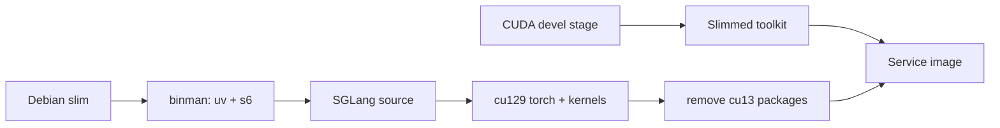

# SGLang Service Design

## Image Build

Qwen3.8-Flash-Next 的 model support 来自固定 upstream revision，因此 image 从 source
安装 SGLang，并跳过 OpenAI HTTP server 不需要的 PyO3 extension。

SGLang 的 FP8 路径依赖 `sgl-deep-gemm`，它会在 import 时 JIT 编译 kernel，因此
镜像必须包含 nvcc 与 CUDA header。独立 CUDA builder stage 先删除 JIT 不需要的
静态库、NPP 和开发期辅助目录，再把精简后的 toolkit 复制到 Debian final stage。

source 的默认依赖与目标 Host CUDA backend 不一致。安装过程必须在同一 layer 内
完成依赖归一化：

1. 强制安装目标 CUDA backend 的 torch 与 GPU kernel。
2. 删除错误 backend 的 NVIDIA package。
3. 重装被共享目录卸载破坏的目标 backend library。
4. 用 import assertion 验证最终环境。

uv 必须把 package 复制进 venv；清理 build cache 后不能留下指向 cache 的 hardlink。

## Runtime

s6 的 `default` bundle 启动唯一 longrun `serve`。该 longrun 加载容器环境后 exec
`/opt/codespace/sglang/serve.sh`，日志写入 `/var/log/serve.log`。

runtime 参数针对单台 8x H100 固定 tensor/expert parallel、长上下文、分块 prefill、
FlashInfer linear attention 与 speculative decoding。启动脚本显式暴露 CUDA Toolkit，
保证 `deep_gemm` 能完成 JIT。

模型 cache 由 managed Service data bind mount 提供。控制面与 smoke 入口都必须请求
全部 GPU、启用 Host IPC，并把对外监听限制在 Host loopback。
