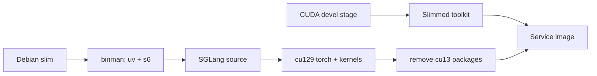

# SGLang Service Design

## Image Build

Qwen3.8-Flash-Next 尚未进入稳定 SGLang release。Dockerfile clone upstream，并通过
`SGLANG_REF=pull/36497/head` 安装 model-support source；`SGLANG_BUILD_RUST_EXTS=none`
跳过 OpenAI HTTP server 不需要的 PyO3 extension。

SGLang 的 FP8 路径依赖 `sgl-deep-gemm`，它会在 import 时 JIT 编译 kernel，因此
镜像必须包含 nvcc 与 CUDA header。`cuda` stage 从
`nvidia/cuda:12.9.1-devel-ubuntu24.04` 取得 toolkit，先删除静态库、NPP 和开发期
辅助目录，再复制 `/usr/local/cuda-12.9` 到 `debian:trixie-slim` final stage。

Python 3.12 venv 位于 `/opt/codespace/sglang/venv`。默认 `CUDA_TAG=cu129`，安装过程
先装 source，再按官方 cu129 index 强制安装 torch、`sglang-kernel` 与
`sgl-deep-gemm`。source 默认会拉入 CUDA 13 package，因此同一 layer 内必须：

1. 卸载 13.x 或 `_cu13` NVIDIA package，并删除 `nvidia/cu13`。
2. 重装 cu12 的 cuDNN、cuSPARSELt、NCCL、NVSHMEM 与 `torchcodec`。
3. 验证 `torch.version.cuda` 为 12.x，且 `torchcodec.decoders` 可 import。

`UV_LINK_MODE=copy` 不能移除，否则删除 uv cache 会破坏 hardlink 到 venv 的文件。

## Runtime

s6 的 `default` bundle 启动唯一 longrun `serve`。该 longrun 加载容器环境后 exec
`/opt/codespace/sglang/serve.sh`，日志写入 `/var/log/serve.log`。

| 变量 | 默认值 | 用途 |
| --- | --- | --- |
| `SERVE_MODEL` | `Qwen/Qwen3.8-Flash-Next-FP8` | 模型 id 或本地路径 |
| `SERVE_HOST` | `0.0.0.0` | 容器内监听地址；Service 配置必须覆盖为 loopback |
| `SERVE_PORT` | `8003` | OpenAI API 端口 |
| `SERVE_EXTRA_ARGS` | 空 | 追加引擎参数 |

`serve.sh` 针对 8x H100 80GB 固定使用 TP8 + EP8、262144 context、0.85 static
memory fraction、chunked prefill、FlashInfer linear attention、NEXTN speculative
decoding 与 Qwen3 parser。它显式导出 `CUDA_HOME`，保证 `deep_gemm` 能找到 toolkit。

模型 cache 由 host 的 `~/codespace/services/sglang` bind-mount 提供，首次启动需要约
200 GiB 可用空间。`smoke.sh` 负责创建标准 Service identity、请求全部 GPU、启用 host
IPC，并把监听地址限制为 `127.0.0.1`。
