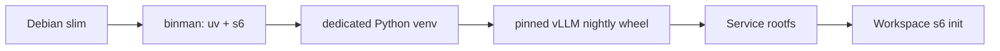

# vLLM Service Design

## Image Build

镜像以 Debian slim 为 base，通过 binman 安装 uv 与 s6 工具，并复用 Workspace
持有的 s6 bootstrap。inference stack 安装在独立 venv。

Qwen3.8-Flash-Next 的 model support 来自固定 upstream revision，因此 image 从 vLLM
per-commit index 安装 nightly wheel，并从匹配目标 Host driver 的 PyTorch index
解析 CUDA backend。

依赖跨 vLLM、PyTorch 与 PyPI 三个 index，解析必须允许在所有 index 中选择满足约束
的最佳版本，避免辅助 package 被某个专用 index 的旧副本锁住。vLLM 不使用
`deep_gemm`，镜像无需完整 CUDA Toolkit；CUDA userspace library 由 wheel 提供，
Host driver 由 NVIDIA Container Toolkit 注入。

## Runtime

s6 的 `default` bundle 启动唯一 longrun `serve`。该 longrun 加载
`/run/s6/container_environment` 后 exec `/opt/codespace/vllm/serve.sh`，日志写入
`/var/log/serve.log`。

runtime 参数针对单台 8x H100 固定 tensor/expert parallel、Triton MoE、长上下文、
分块 prefill、prefix cache 与 Qwen3 parser。显存不足时由运行配置降低上下文或显存
利用率，不改变 image。

模型 cache 由 managed Service data bind mount 提供。控制面与 smoke 入口都必须请求
全部 GPU、启用 Host IPC，并把对外监听限制在 Host loopback。
