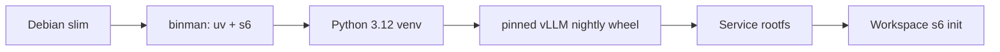

# vLLM Service Design

## Image Build

镜像以 `debian:trixie-slim` 为 base，通过 binman 安装 uv 与 s6 工具，并复用
Workspace 持有的 s6 bootstrap。Python 3.12 venv 位于
`/opt/codespace/vllm/venv`。

Qwen3.8-Flash-Next 架构尚未进入稳定 vLLM release，Dockerfile 通过
`VLLM_COMMIT=e126687a9a828d513c01a07cd69f025f27d63280` 从 vLLM per-commit
nightly index 安装。`CUDA_TAG=cu129` 对齐该 wheel 固定的 `torch==2.13.0`，同时可在
目标 CUDA 12.x driver 上运行；CUDA 13 host 可改用 `cu130`。

依赖跨 vLLM、PyTorch 与 PyPI 三个 index，安装必须保留
`--index-strategy unsafe-best-match`，否则 uv 可能从 PyTorch index 选择过旧的
`packaging`。vLLM 不使用 `deep_gemm`，镜像无需完整 CUDA Toolkit；CUDA userspace
library 由 wheel 提供，host driver 由 NVIDIA Container Toolkit 注入。

## Runtime

s6 的 `default` bundle 启动唯一 longrun `serve`。该 longrun 加载
`/run/s6/container_environment` 后 exec `/opt/codespace/vllm/serve.sh`，日志写入
`/var/log/serve.log`。

| 变量 | 默认值 | 用途 |
| --- | --- | --- |
| `SERVE_MODEL` | `Qwen/Qwen3.8-Flash-Next-FP8` | 模型 id 或本地路径 |
| `SERVE_HOST` | `0.0.0.0` | 容器内监听地址；Service 配置必须覆盖为 loopback |
| `SERVE_PORT` | `8003` | OpenAI API 端口 |
| `SERVE_EXTRA_ARGS` | 空 | 追加引擎参数 |
| `VLLM_PLE_CPU_OFFLOAD` | 空 | 可选 N-gram embedding CPU offload |

`serve.sh` 针对 8x H100 80GB 固定使用 TP8 + Expert Parallel、Triton MoE、
262144 context、0.85 GPU memory utilization、chunked prefill、prefix cache 与 Qwen3
reasoning/tool parser。临时覆盖使用 `SERVE_EXTRA_ARGS`；显存不足时优先降低 context
或 memory utilization。

模型 cache 由 host 的 `~/codespace/services/vllm` bind-mount 提供，首次启动需要约
200 GiB 可用空间。`smoke.sh` 负责创建标准 Service identity、请求全部 GPU、启用 host
IPC，并把监听地址限制为 `127.0.0.1`。
