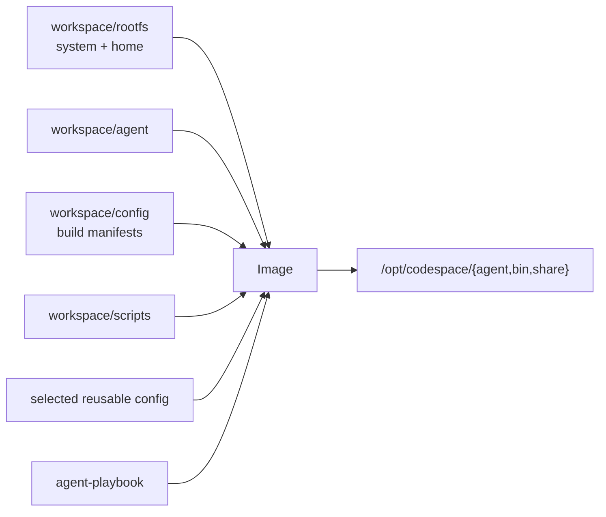
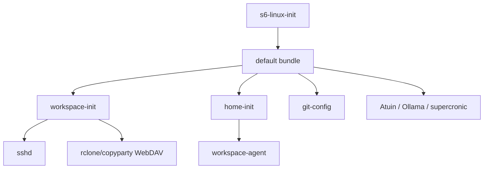
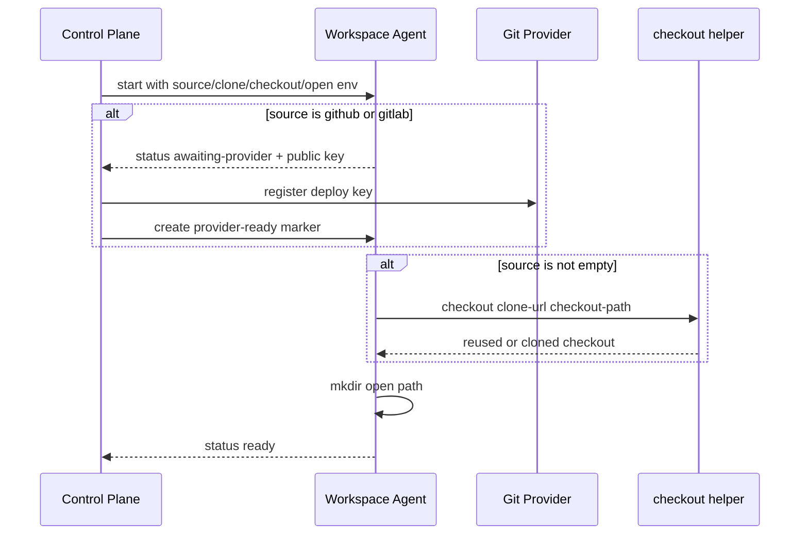

# Workspace Image Design

## Build Layout

Workspace image 使用仓库根作为 build context，但只复制声明的输入：

`rootfs/` 拥有 Workspace service、系统配置和 `home/x/` 下的镜像专属用户配置。
s6 skeleton 位于 `rootfs/etc/s6/skel/`，`scripts/install-s6.sh` 在 build 时
编译 `/etc/s6/db` 并生成 `/etc/s6/init`；Service image 只复用这两项。
Agent playbook 在 build 时合并到 `/home/x`，并保留 rootfs 中的 Workspace rule。
重复的 Trae 配置、Workspace rule 与 remote settings 分别通过相对软链接指向
`.trae` 和 `.vscode-server` 中的 canonical 文件。

## Startup

`workspace-init` 是 Workspace 数据就绪门控。它先以 `5230:5230`、`0700` 幂等准备
`/workspace`、`/workspace.enc`、`/upload` 和 `/cache`；存在
`CODESPACE_WORKSPACE_KEY` 时初始化或复用 gocryptfs，再把明文挂到
`/workspace`。

`home-init` 不依赖 `workspace-init`。它准备五个 IDE home 下持久化的 `bin` 与
`extensions` mount，无条件生成或复用 deploy key，并从
`/opt/codespace/share` 播种 editor extensions。Trae 配置、remote settings 与
rules 位于 image 的 `/home/x`，不在启动时复制。

## Agent Protocol

Workspace Agent 绑定 `/run/codespace-control/agent.sock`，提供：

| Method | Path         | Response                                            |
| ------ | ------------ | --------------------------------------------------- |
| `GET`  | `/status`    | `state`、GitHub/GitLab deploy `public_key`、`error` |
| `GET`  | `/git-state` | `unpushed`、`uncommitted`、最多 20 条 `detail`      |

未注入 `CODESPACE_SOURCE_TYPE` 时进程保持 idle，不创建 socket。受管 Workspace 的
bootstrap 流程为：

`checkout` 对已有完整 Git checkout 或已标记的 empty repository 幂等；非 Git
target 必须 fail-fast，避免覆盖持久数据。`/git-state` 只在非 empty source 且
Agent ready 时可用。

## Persistent Data

control plane 将同一 Workspace 的数据映射为：

| Container path                                       | Purpose                               |
| ---------------------------------------------------- | ------------------------------------- |
| `/workspace` 或 `/workspace.enc`                     | plaintext checkout 或 ciphertext root |
| `/upload`                                            | WebDAV 可写交换目录                   |
| `/cache`                                             | IDE 持久数据源                        |
| `/run/codespace-control`                             | provider marker 与 Agent UDS          |
| `/home/x/.{vscode-server,trae,...}/{bin,extensions}` | `/cache` 下十个直接 mount             |

Agent 子进程固定以 uid/gid `5230:5230`、`HOME=/home/x` 执行。provider token
不进入镜像，deploy private key 不离开 Workspace。
