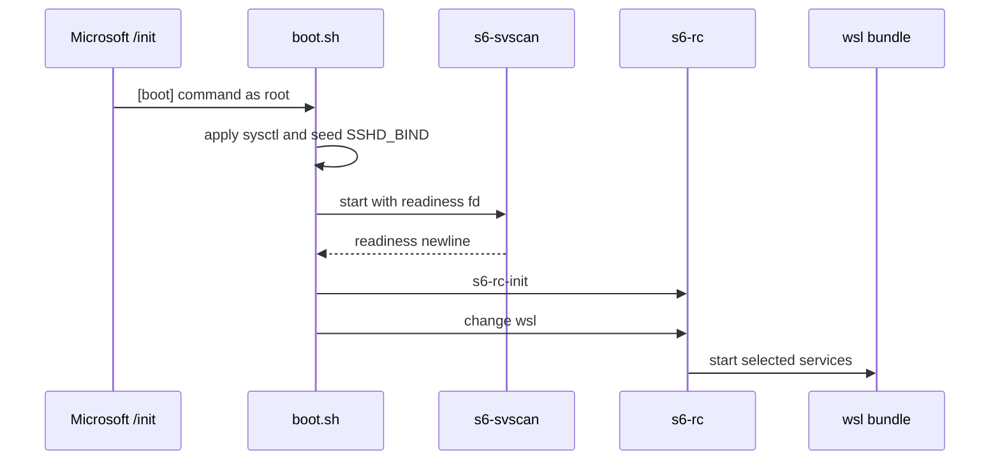

# WSL Platform Design

## Export Model

WSL 消费单层 rootfs tar，而不是 OCI image metadata：

`docker export` 会丢弃 `ENTRYPOINT`、`CMD` 与 `ENV`。因此 OCI image 仅提供待压平
filesystem，WSL 的全部启动 wiring 都由 `/etc/wsl.conf` 和
`/opt/codespace/wsl/boot.sh` 承担。

## Boot Flow

Workspace image 的 `s6-linux-init` 仅在自身为 PID 1 时有效；WSL 的 PID 1 固定为
`/init`，所以 `boot.sh` 直接建立 `/run/service` supervision tree。readiness fd
保证 `s6-rc-init` 不会在 `s6-svscan` 接管 scandir 前运行。

Dockerfile 在叠加 `wsl` bundle 后重编译 `/etc/s6/db`。否则 inherited database
无法解析新 bundle。

## SSH And Keep-Alive

`boot.sh` 只负责让 sshd 监听 `0.0.0.0`。LAN 可达性由 Windows 选择：

- Windows 11 mirrored networking 直接使用 Windows LAN address。
- NAT 模式使用 `netsh interface portproxy` 并配置 firewall。

WSL distribution 没有被跟踪的交互会话时可能被自动停止；`[boot] command` 创建的
service 不构成 keep-alive。`windows/wslconfig.sample` 首选通过
`instanceIdleTimeout=-1` 与 `vmIdleTimeout=-1` 禁用回收；不支持该设置时，
`windows/setup-keepalive.ps1` 注册 SYSTEM Scheduled Task，运行
`wsl.exe -d codespace -u root -- sleep infinity`。
