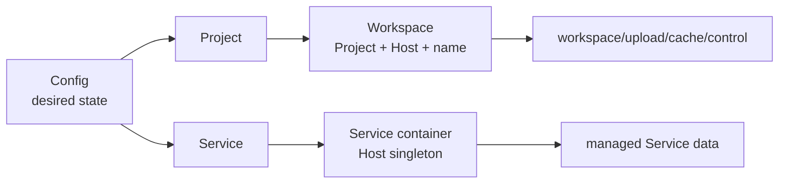
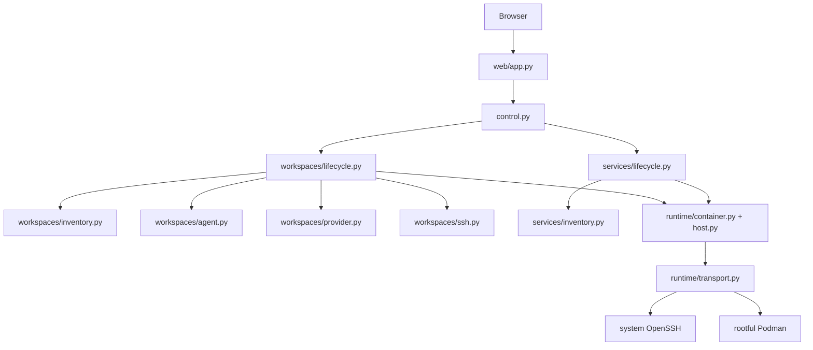
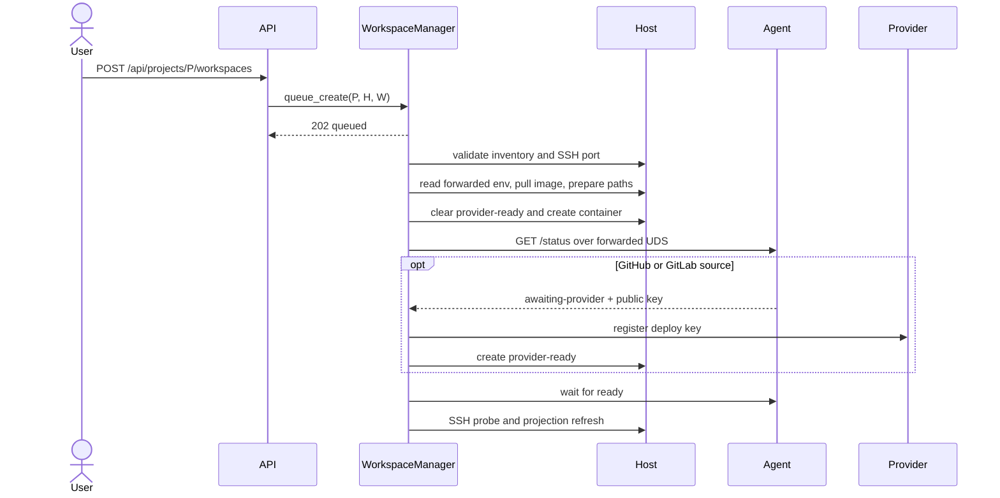
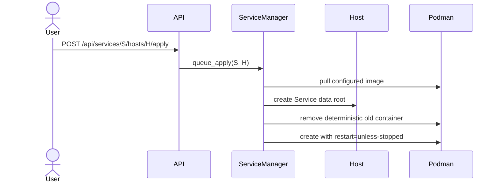

# Codespace Control Plane Design

## Domain Model



- **Project**：声明 source、Workspace image、可用 Host 与容器参数的配置蓝图。
- **Workspace**：Project 在一个 Host 上的具名持久副本及其运行容器。
- **Service**：配置选择在一个或多个 Host 上运行的单例常驻容器。
- **Host**：通过 SSH 访问并提供 rootful Podman 的执行节点。
- **Operation**：单进程内的短期 lifecycle 状态，进程重启后丢弃。

Podman inventory 是实际运行状态的唯一来源。Config 只表达期望形态，Dashboard 不缓存容器状态。
Workspace 与 Service 通过 `codespace.kind` 使用不相交 inventory filter。

## Components



`PodmanTransport` 是 Podman clients、per-Host OpenSSH ControlMaster 和 UDS forwards 的唯一 owner。
Manager 只接收 Config 解析出的 immutable spec，不解析 YAML。FastAPI route 只做输入输出和错误映射。

## Placement Resolution

Project 按以下顺序按字段覆盖：

```text
project_defaults -> projects.<project> -> projects.<project>.hosts.<host>
```

Service 按以下顺序按字段覆盖：

```text
services.<service> -> services.<service>.hosts.<host>
```

list 与 mapping 都整体替换。`ContainerSpec` 只接受 canonical mapping，不接受字符串缩写。Config 启动时
验证 Host 引用、network mode、port 使用、保留 env、保留 mount 和受控 placeholder。

## Host Data

```text
$HOME/codespace/
├── workspaces/
│   └── <project>/<workspace>/
│       ├── workspace/
│       ├── upload/
│       ├── cache/
│       └── control/
└── services/
    └── <service>/
```

普通 Workspace 把 host `workspace/` bind 到 `/workspace`。加密 Workspace 把同一路径 bind 到
`/workspace.enc`，由镜像内 gocryptfs 挂载明文 `/workspace`。`upload/`、`cache/` 与五个 IDE home
目录始终明文。`control/` 权限为 `0700`，保存 `provider-ready` 和 `agent.sock`。

Service 不拥有 Workspace mount、SSH 投影或 repository credential。`${SERVICE_DATA}` 仅在 Service volume
source 中解析为 `~/codespace/services/<service>`。

## Workspace Create



失败不回滚。容器、provider key 和 Host 数据保留，operation 进入 `failed` 并携带 cause chain。

## Workspace Delete

Git-backed Workspace 在 `force=false` 时通过 Agent `/git-state` 做只读预检。停止状态不会被启动用于检查；
调用方必须显示数据丢失风险后显式 `force=true`。Provider key 撤销必须先成功，之后才允许删除容器或数据。
`purge=false` 保留 Workspace 数据，`purge=true` 删除完整 Workspace 根目录。

## Service Apply



重复 apply 收敛到当前配置。remove 只删容器；`purge=true` 再删托管 Service 数据。

## Workspace Agent

Agent 只监听 `/run/codespace-control/agent.sock`：

| Method | Path | Result |
| --- | --- | --- |
| `GET` | `/status` | `{state, public_key, error}` |
| `GET` | `/git-state` | `{unpushed, uncommitted, detail}` |

状态仅为 `starting`、`awaiting-provider`、`ready`、`failed`。控制面只传 source、clone URL、
checkout/open path，不传 provider token。private key 不离开 Workspace 容器。readiness 后仍执行完整 SSH
登录探测。

## Maintenance

`secrets sync`、`workspaces prune`、`deploy-keys prune` 都先跨 Host 或 repository 生成完整计划，再由
`--apply` 执行。单个目标失败必须隔离并进入最终错误汇总；维护逻辑直接复用 Config、inventory、provider、
Host 和 Podman 原语，不经过 HTTP。
