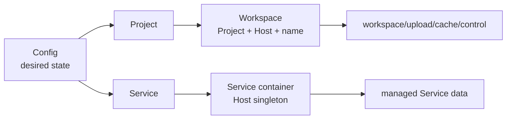
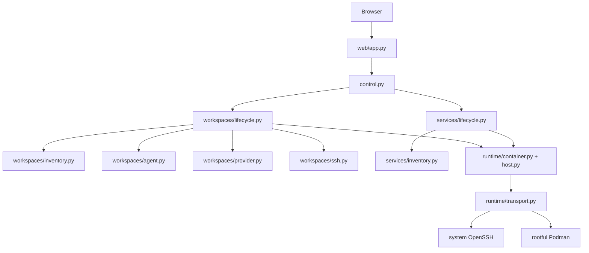
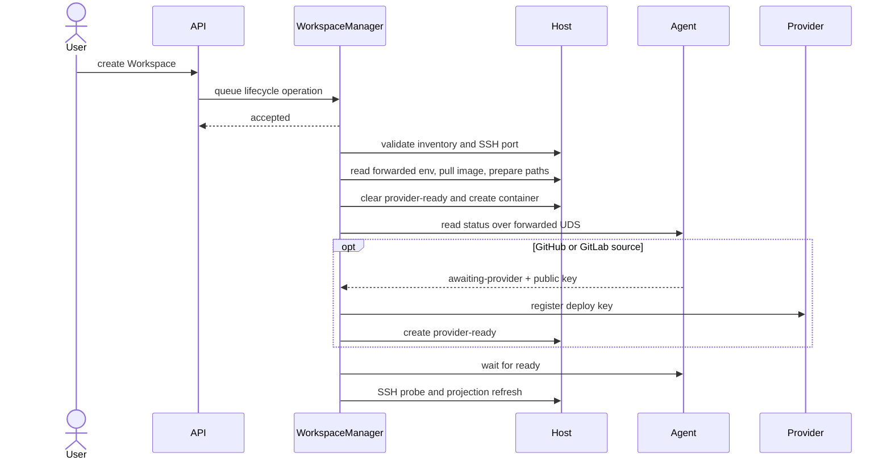
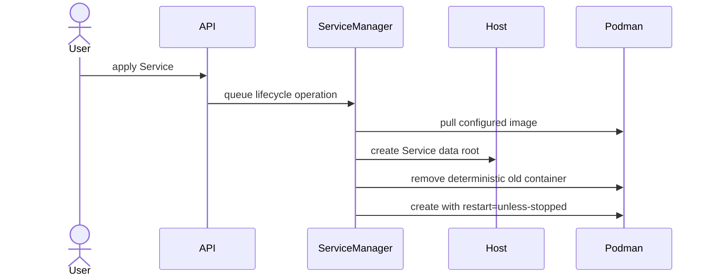

# Codespace Control Plane Design

## Domain Model



- **Project**：声明 source、Workspace image、可用 Host 与容器参数的配置蓝图。
- **Workspace**：Project 在一个 Host 上的具名持久副本及其运行容器。
- **Service**：配置选择在一个或多个 Host 上运行的单例常驻容器。
- **Host**：通过 SSH 访问并提供 rootful Podman 的执行节点。
- **Operation**：单进程内的短期 lifecycle 状态，进程重启后丢弃。

Podman inventory 是实际运行状态的唯一来源。Config 只表达期望形态，Dashboard 不缓存容器状态。
Workspace 与 Service 通过 `codespace.kind` 使用不相交 inventory filter。

## Components



`PodmanTransport` 是 Podman clients、per-Host OpenSSH ControlMaster 和 UDS forwards 的唯一 owner。
ControlMaster 的初始 SSH handshake 跨 Host 串行执行，避免共享 ProxyJump 的并发 GSSAPI
认证竞争；连接建立后的 Host 操作保持并发。Manager 只接收 Config 解析出的 immutable spec，
不解析 YAML。FastAPI route 只做输入输出和错误映射。

## Placement Resolution

Project 按以下顺序按字段覆盖：

```text
project_defaults.container
  -> hosts.<host>.container
  -> projects.<project>.container
  -> projects.<project>.hosts.<host>.container
```

Service 按以下顺序按字段覆盖：

```text
hosts.<host>.container
  -> services.<service>.container
  -> services.<service>.hosts.<host>.container
```

Host container 是该 Host 上 Project 与 Service 共用的默认层。Project image 仍按
`project_defaults -> projects.<project> -> projects.<project>.hosts.<host>` 覆盖；platform 按
`hosts.<host> -> projects.<project>.hosts.<host>` 覆盖。list 与 mapping 都整体替换。
`ContainerSpec` 使用 Compose service 字段名，volume 接受 Compose short syntax 与 bind long
syntax，解析后统一为结构化数据。Config 启动时验证 Host 引用、network mode、port 使用、保留
env、保留 mount 和受控 placeholder。

## Host Data

```text
$HOME/codespace/
├── workspaces/
│   └── <project>/<workspace>/
│       ├── workspace/
│       ├── upload/
│       ├── cache/
│       └── control/
└── services/
    └── <service>/
```

普通 Workspace 把 host `workspace/` bind 到 `/workspace`。加密 Workspace 把同一路径 bind 到
`/workspace.enc`，由镜像内 gocryptfs 挂载明文 `/workspace`。`upload/`、`cache/` 与 IDE runtime
目录始终明文。`control/` 权限为 `0700`，保存 provider readiness 与 Agent UDS。

Service 不拥有 Workspace mount、SSH 投影或 repository credential。Service volume 只能通过受控
placeholder 引用自己的 managed data root。

## Workspace Create



失败不回滚。容器、provider key 和 Host 数据保留，operation 进入 `failed` 并携带 cause chain。

## Workspace Delete

Git-backed Workspace 默认通过 Agent 做只读 Git state 预检。停止状态不会被启动用于检查；
调用方必须显示数据丢失风险后显式强制删除。Provider key 撤销必须先成功，之后才允许
删除容器或数据；是否清理完整 Workspace 数据由调用方明确选择。

## Service Apply



重复 apply 收敛到当前配置。remove 默认只删容器，显式 purge 才删除 managed Service data。

## Workspace Agent

Agent 只监听 Workspace control UDS，向控制面提供 bootstrap readiness、deploy public key
与只读 Git state。控制面只传 source 与 checkout specification，不传 provider token；
private key 不离开 Workspace。Agent ready 后控制面仍执行完整 SSH 登录探测。

## Maintenance

维护命令先跨 Host 或 repository 生成完整计划，再由显式 apply 执行。单个目标失败必须隔离并进入
最终错误汇总；维护逻辑直接复用 Config、inventory、provider、Host 和 Podman 原语，不经过 HTTP。
